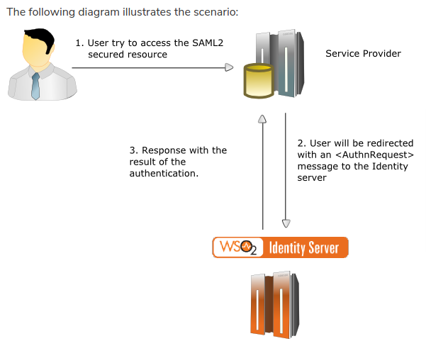
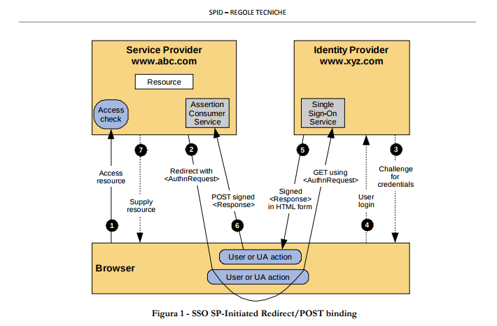

Appendice: SAML
===============

Il protocollo SAML in breve
---------------------------

SAML è il mezzo (o più specificatamente il framework/protocollo) 
attraverso cui SPID realizza la parte di autenticazione.

Le entità (**entity**) coinvolte nel protocollo SAML sono fondamentalmente 2:

1. il **Service Provider** (`SP`)che è il servizio web di cui l'utente vuole usufruire
2. l' **Identity Provider** (`IdP`) che è il server di autenticazione SSO e verifica le credenziali dell'utente

Esempi di IdP sono Poste Italiane, Aruba, etc., quindi probabilmente non lo si dovrà reimplementare.

    La relazione tra i 3 soggetti del protocollo SAML

Più in dettaglio le fasi del processo di autenticazione sono mostrate come da schema seguente

    Le fasi del processo di autenticazione SAML

L'entityID
----------

L'unico campo richiesto obbligatoriamente nella configurazione di un **Service Provider** è l'entity ID.
L'entity Id di un Service Provider deve essere univoco all'interno dell'Identity Provider cui si registra,
per questo di solito si usa il FQDN.

L'AssertionConsumerService
-------------------------------

Almeno un elemento di questo tipo deve essere definito nei metadati di un **Service Provider**.

`<AssertionConsumerService>` [One or More]
One or more elements that describe indexed endpoints that support the profiles of the
Authentication Request protocol defined in [SAMLProf]. All service providers support at least one
such endpoint, by definition.

The <md:AssertionConsumerService> element is used to configure handlers that are responsible for consuming SAML assertions; that is, they process an assertion according to a profile, extract its contents, create a new user session, and typically produce a cookie to represent the session.

I metadati
----------

Ogni **entità** del protocollo deve esporre dei metadati e questi sono differenti sia per tipologia che per contenuto.
Infatti ogni entità può assumere uno dei ruoli:

* SSO Identity Provider
* SSO Service Provider
* Authentication Authority
* Attribute Authority
* Policy Decision Point
* Affiliation

e a seconda di quelli assunti specifica degli elementi XML differenti ad esempio:

* SPSSODescriptor: per le funzioni di Service Provider
* IDPSSODescriptor: per le funzioni di Identity Provider

Nell'SP si devono configurare i metadati dall'IdP e l'IdP deve avere i metadati dell'SP

Altro
-----

Ulteriori informazioni posso essere trovate:

.. todo: ampliare reference

* https://wiki.oasis-open.org/security/FrontPage
* https://docs.spring.io/spring-security-saml/docs/current/reference/html/configuration-metadata.html
